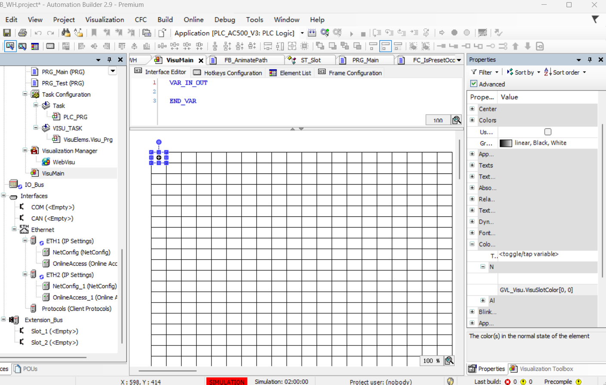
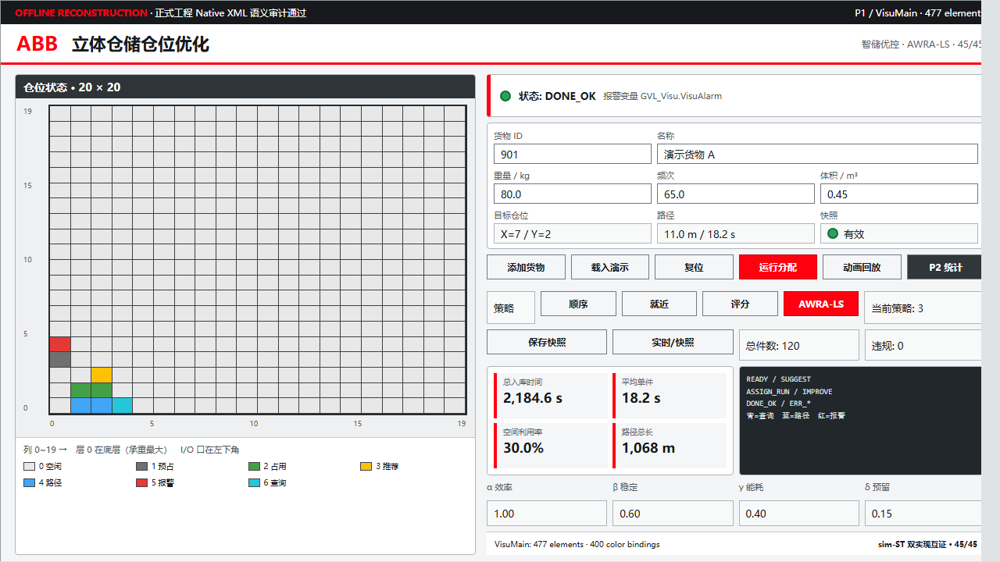
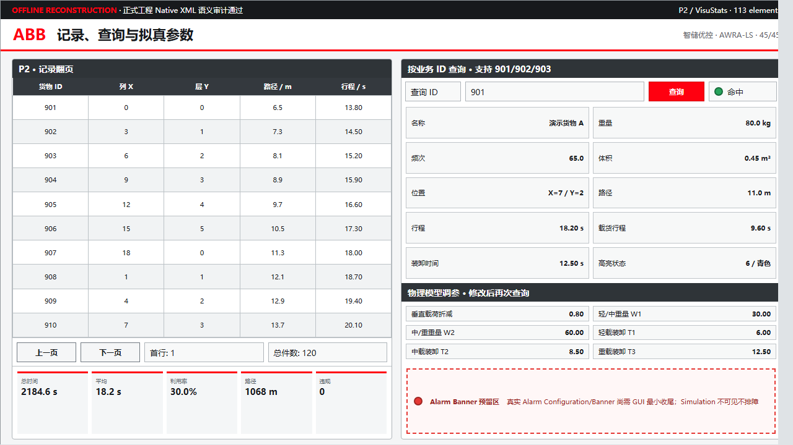

# Codex -> Claude Code 夜间任务交接报告（2026-07-10）

> 状态时间：2026-07-10 17:33:47 -05:00  
> 正式工程：`F:\abb_wh_work\plc\AB_Project\ABB_WH.project`  
> 任务依据：`docs\Codex执行单_块3画面_0710.md`、`2_你要操作\AB可视化搭建操作卡.md`、`2_你要操作\AB可视化搭建操作卡_块3增补.md`  
> 真相源边界：未修改任何 PLC ST、GVL、POU、PRG、任务配置或设备参数。

## Current State Summary

正式工程已经完成批次 A、B、C：`VisuMain=477`、`VisuStats=113`，编译 `0 errors / 1 warning`，PLC 回归测试 `45 passed / 0 failed`。批次 D 仅确认 `WebVisu` 已存在且 `StartVisu33=VisuMain`，报警配置与 Alarm Banner 仍待 GUI 补齐。

## Important Context

只允许继续编辑 Visualization、Visualization Manager、WebVisu 和 Alarm Configuration。不得重做 P1/P2，不得修改任何 ST；Simulation 中 WebVisu 打不开或 Alarm Banner 看不见均按 0710 新口径视为正常，禁止围绕这两种现象排障。正式 HMI 使用 ASCII/English 是为规避工程未持久启用 UTF-8 导致中文变成 `?` 的风险。

## Immediate Next Steps

1. 核对正式工程 SHA-256，并确保没有另一个 `AutomationBuilder.exe` 实例。
2. 只补 `AC_High`、`AG_WH`、Digital alarm 与 `Alarm Banner`。
3. 保存后做 F11 `0 errors` 和 `PRG_Test 45/0` 最终验收。

## Critical Files

- 正式工程：`F:\abb_wh_work\plc\AB_Project\ABB_WH.project`
- 施工前备份：`F:\abb_wh_work\plc\AB_Project\ABB_WH.before_visu_pages_20260710_140823.project.bak`
- 本交接报告：`F:\abb_wh_work\docs\evidence_0710\Codex_ClaudeCode_夜间任务交接_20260710.md`
- 最终生成器：`F:\abb_wh_spike\visu_native_20260710_1225\build_visu_pages_ascii.py`

## Decisions Made

- 批次 B/C 使用 ABB/CODESYS 官方 Visualization scripting API 生成，不继续手工 GUI 复制。
- 正式 HMI 标签采用 ASCII/English，避免当前工程编码设置破坏中文。
- 输入 ID 仅限制最小值 1，不限制最大值 400，以兼容演示数据 901/902/903。
- Alarm Configuration 不使用未公开内部 API 强写，保留为 GUI 接续项。

## Potential Gotchas

- ABB 无界面进程可能在 PowerShell 返回后仍运行；启动下一项前必须检查进程已经退出。
- 同时打开两个 ABB 实例可能锁工程或触发恢复提示。
- B/C 截图是离线重建图，不是真实在线运行截图，汇报时必须保留该标签。

## 1. 一句话结论

批次 A 已完成，批次 B/C 已通过 ABB 官方 `ScriptVisualization` 接口写入正式工程并完成编译、回归测试和结构审计；批次 D 的 `WebVisu` 已存在且起始画面正确，但 `Alarm Configuration / AC_High / AG_WH / Alarm Banner` 尚未完成。当前正式工程可继续使用，不需要重做 400 格网格、P1 或 P2。

## 2. 当前验收状态

| 批次 | 状态 | 已验证事实 | 尚缺内容 |
|---|---|---|---|
| A：20×20 仓位网格 | 完成 | `VisuMain` 中有 400 个 `GVL_Visu.VisuSlotColor[row,col]` 绑定；实际 AB 截图已归档 | 无 |
| B：堆垛机与主交互面板 | 完成（结构验收） | `VisuMain` 共 477 个元素；堆垛机、输入、命令、策略、统计、权重、图例均由脚本生成；命令按钮采用按下 TRUE/抬起 FALSE | 尚未做真实在线交互截图；按 0710 口径不影响配置+编译验收 |
| C：P2 统计查询页 | 完成（结构验收） | `VisuStats` 共 113 个元素；10 行记录表、查询区、调参区、P1/P2 导航均已生成 | 尚未做真实在线交互截图 |
| D：报警条与 WebVisu | 部分完成 | 工程中已有 `WebVisu`；`Visualization Manager` 的 `StartVisu33=VisuMain`；编译 0 错 | 缺 `Alarm Configuration`、`AC_High`、`AG_WH`、Digital alarm 和 `Alarm Banner` |

## 3. 正式工程验证结果

### 3.1 编译

```text
Compile complete -- 0 errors, 1 warnings
Additional code checks complete -- 0 errors
```

唯一 warning 是既有通信未加密提示，不是可视化或算法错误。

### 3.2 PLC 回归测试

```text
PRG_Test.iPassed = INT#45
PRG_Test.iFailed = INT#0
PRG_Test.sLastFail = ''
PRG_Test.xAllPass = TRUE
```

结论：可视化施工未破坏验收块 1-2 的 PLC 算法行为。

### 3.3 ST/文本对象不变审计

```text
BEFORE_TEXT_OBJECTS=73
AFTER_TEXT_OBJECTS=73
TEXT_ADDED=0
TEXT_REMOVED=0
TEXT_CHANGED=0
```

该审计把施工前工程与当前正式工程的所有 `textual_declaration`、`textual_implementation` 逐对象比较。结果证明本轮没有改动 ST 文本。

### 3.4 可视化对象审计

```text
VisuMain elements=477
VisuStats elements=113
WebVisu found=1
Visualization Manager found=1
StartVisu33=VisuMain
```

导出 XML 的补充统计：

| 文件 | 大小 | 网格颜色绑定 | TRUE | FALSE | 非 ASCII 字符 |
|---|---:|---:|---:|---:|---:|
| `VisuMain_ascii_after.xml` | 6,152,758 B | 400 | 6 | 6 | 0 |
| `VisuStats_ascii_after.xml` | 1,450,325 B | 0 | 3 | 3 | 0 |

`TRUE/FALSE` 数量用于确认脉冲命令具有按下和释放两个动作；不是全部语义绑定的总数。

## 4. 关键实现决策

### 4.1 从 GUI 自动点击转为官方脚本接口

Automation Builder GUI 路线发生过 4 次受控崩溃，继续依赖 Computer Use 会慢且不稳定。随后确认 ABB/CODESYS 内置的 `ScriptVisualization` API 可创建 Visualization、添加元素、设置属性和输入动作，于是在独立实验副本中完成 smoke test 后才迁移到正式工程。

收益：生成可重复、绑定可导出审计、不会手工复制数百元素。  
风险：Alarm Configuration/Alarm Banner 没有找到公开的等价创建 API，因此不能用同一路线可靠完成批次 D。  
边界：没有使用未验证的内部 API 强改报警对象。

### 4.2 命令按钮使用 OnMouseDown/OnMouseUp 脉冲

PLC 命令变量按上升沿消费。按钮统一配置为：

```text
OnMouseDown -> TRUE
OnMouseUp   -> FALSE
```

这样每次点击都能产生新的上升沿，避免变量长期保持 TRUE 后后续点击失效。

### 4.3 正式 HMI 静态标签改为 ASCII/English

当前 ABB 工程的 `STRING UTF8 Encoding` 编译选项关闭。中文静态标签会产生大量 `C0555 non-representable characters`，并可能在运行时显示为 `?`。尝试通过脚本设置该选项只在当前进程生效，重新打开工程后不持久。

因此正式工程采用 English/ASCII 标签，保留正确编译与可移植性；中文说明、教学资料和本交接报告不受影响。中文可视化版本另有备份，不能直接作为最终运行版。

### 4.4 输入编号不限制 Max=400

增补卡写了 ID 最大值 400，但项目演示数据含 `901/902/903`，PLC 侧也没有该上限。为避免 HMI 错误拒绝有效演示数据，正式画面仅限制最小值 1，不设置最大值。该差异是有意决策，不要无依据改回 400。

## 5. 文件、备份与哈希

### 5.1 正式工程

```text
F:\abb_wh_work\plc\AB_Project\ABB_WH.project
SHA256 97839D50B24E4ED14BA913B01AA98B8538F9B3C4D62E4E4CD9904E8CBDE70ACA
```

### 5.2 回滚备份

```text
施工前：
F:\abb_wh_work\plc\AB_Project\ABB_WH.before_visu_pages_20260710_140823.project.bak
SHA256 185D6D5EAF3CA88D8AFE2860C23B90F7BFF1BCCDA5B99424263CC741DFD8EA2E

中文标签实验版：
F:\abb_wh_work\plc\AB_Project\ABB_WH.chinese_visu_20260710_1455.project.bak
SHA256 D193DFDE88342E4FE0BD0DA5C081385C2D75595EE58328B328AA0F7F11BF8C1D
```

### 5.3 独立实验与生成器

```text
实验副本根目录：
F:\abb_wh_spike\visu_native_20260710_1225\

最终 ASCII 生成器：
F:\abb_wh_spike\visu_native_20260710_1225\build_visu_pages_ascii.py

正式导出 XML：
F:\abb_wh_spike\visu_native_20260710_1225\VisuMain_ascii_after.xml
F:\abb_wh_spike\visu_native_20260710_1225\VisuStats_ascii_after.xml

审计脚本与结果：
F:\abb_wh_spike\visu_native_20260710_1225\audit_formal_visu.py
F:\abb_wh_spike\visu_native_20260710_1225\audit_formal_visu_result.txt
F:\abb_wh_spike\visu_native_20260710_1225\VisualizationManager_formal.xml
```

`abb_wh_spike` 是独立一次性实验目录，不属于 Claude Code 的工作目录；不要把它误当成正式工程。

## 6. 证据截图

### A：真实 AB 20×20 网格



### B：P1 离线重建设计核对图



### C：P2 离线重建设计核对图



注意：B/C 是根据已写入元素和绑定制作的离线重建图，用于检查布局和信息架构，不应冒充 Automation Builder 在线运行截图。

## 7. 已知失败与不要重复做的事

1. 不要重新生成 400 格，不要重做 P1/P2；正式工程已经保存并通过结构审计。
2. 不要同时启动两个 Automation Builder 实例；无界面脚本也要等待进程完全退出后再启动下一项。
3. 不要为 Simulation 下 `localhost:8080` 打不开 WebVisu 排障；0710 执行单明确把它视为正常架构限制。
4. 不要为 Simulation 中 Alarm Banner 看不见排障；批次 D 验收只看配置对象齐全和编译 0 错。
5. 不要继续尝试不持久的 `CompileOptions.LocalOptions.Utf8Encoding` 内部设置。
6. 不要导入旧 CODESYS `AlarmTableExample.project` 到正式工程；版本转换/打开曾阻塞，且不值得为一个报警条扩大风险。
7. 不要改任何 ST 来“配合画面”。当前算法回归基线是 45/0，红线仍有效。

## 8. Git/工作区状态

交接时可见：

```text
 M plc/AB_Project/ABB_WH.project
 M tools/ab_scripting/check_result.txt
 M tools/ab_scripting/visu_main_native.xml
?? docs/evidence_0710/
```

说明：

- `ABB_WH.project` 是本轮正式可视化变更。
- `check_result.txt`、`visu_main_native.xml` 是验证/导出产物。
- `docs/evidence_0710/` 是截图和本交接报告。
- 未执行 `git reset`、`checkout` 或删除用户原有改动。

## 9. Claude Code 接手后的立即动作（严格按顺序）

1. **只读确认**：打开本报告，核对正式工程 SHA-256；确认没有正在运行的 `AutomationBuilder.exe` 后再打开工程。
2. **只补批次 D**：在 GUI 中创建 `Alarm Configuration`、Class `AC_High`、Group `AG_WH`、Digital alarm `GVL_Visu.VisuAlarm = TRUE`，然后在 `VisuMain` 底部放 `Alarm Banner`；不要改 P1/P2 或 ST。
3. **最终验收**：保存，F11 编译确认 `0 errors`，再运行 `PRG_Test` 确认 `45/0`；按 0710 新口径记录“WebVisu 在 Simulation 不打开、Banner 不显示均不排障”。

## 10. 剩余交付清单

- [ ] 批次 D Alarm Configuration：`AC_High`。
- [ ] Alarm Group：`AG_WH`。
- [ ] Digital alarm：`GVL_Visu.VisuAlarm = TRUE`。
- [ ] Alarm message：`Warehouse alarm: no feasible slot / invalid input`。
- [ ] `VisuMain` 底部 Alarm Banner，绑定 `AG_WH`，显示 Newest。
- [ ] 保存并 F11：0 errors。
- [ ] `PRG_Test`：45 passed / 0 failed。
- [ ] 追加批次 D 配置截图与最终复核报告。

## 11. 继续点

当前没有后台 ABB 审计任务需要等待。下一步不是继续脚本生成，而是决定是否再次进入 GUI，仅完成批次 D 的 5 个报警配置对象；若 GUI 再次崩溃，应停止并把批次 D 明确标记为人工接续项，不能声称全部完成。
